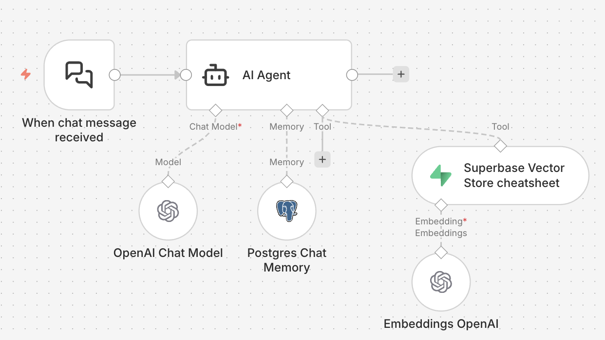

# N8N RAG AI Resume Assistant

An N8N workflow that uses **RAG (Retrieval-Augmented Generation)** to answer questions about someone's resume. Use it on a personal website, portfolio, or adapt it for any site where you want a resume-aware AI chat.

---

## 1. Overview

This is an N8N workflow that uses RAG to answer questions about someone's resume. It can be embedded in a personal website or modified to run on any website. Visitors chat with an AI that has access to your resume content, so answers are grounded in your actual experience, skills, and background—not generic or hallucinated.

---

## 2. What is RAG?

**RAG (Retrieval-Augmented Generation)** means the AI doesn’t only rely on its training: it first **retrieves** relevant chunks of your documents (e.g. resume), then **generates** answers using that context. So responses are accurate, specific to you, and less prone to making things up.

---

## 3. How Does It Work?

The workflow is a chat-style RAG pipeline built in N8N with these pieces:

| Component | Role |
|-----------|------|
| **N8N** | Orchestrates the workflow and exposes a chat API via webhook. |
| **OpenAI (ChatGPT)** | **GPT-4o-mini** powers the conversational agent that reads context and writes answers. |
| **OpenAI Embeddings** | Turns your resume text into vectors so it can be searched by meaning. |
| **Supabase Vector Store** | Stores those vectors (in a `documents` table) and runs similarity search to find the most relevant resume snippets for each question. |
| **Postgres Chat Memory** | Keeps the last 10 messages of the conversation so the assistant can refer to recent context. |

**Flow:** User sends a message → N8N chat trigger receives it → The AI agent uses the Supabase vector store as a tool to look up resume content → The agent (GPT-4o-mini) answers using that context and chat memory → Response is sent back to the user.

### Workflow Screenshot

You need to **ingest your resume** into Supabase (e.g. chunk and embed it, then insert into the vector store) separately; this workflow assumes that data is already in the `documents` table.

---

## 4. How to Use It

### Prerequisites

- **N8N** (self-hosted or N8N Cloud)
- **OpenAI API key** (for GPT-4o-mini and embeddings)
- **Supabase** project with:
  - A table (e.g. `documents`) set up for vector storage (pgvector)
  - Your resume content chunked and embedded into that table
- **Postgres** (for chat memory; can be Supabase Postgres or another Postgres instance)

### Setup

1. **Import the workflow**  
   In N8N, import `workflow.json` (Editor → Import from File).

2. **Configure credentials in N8N**  
   - **OpenAI**: Add your OpenAI API key for the Chat Model and Embeddings nodes.  
   - **Supabase**: Add Supabase credentials and point the Vector Store node to your project and `documents` table.  
   - **Postgres**: Add Postgres credentials for the Chat Memory node (create the required tables if your N8N/Postgres setup doesn’t do it automatically).

3. **Load your resume into Supabase**  
   Chunk your resume (by section or by paragraph), generate embeddings with the same OpenAI embedding model used in the workflow, and insert the vectors into your Supabase `documents` table. You can use a separate N8N workflow, a script, or Supabase Edge Functions to do this.

4. **Activate the workflow**  
   Turn the workflow on in N8N. The chat trigger will expose a webhook URL.

5. **Connect your website**  
   - Use the webhook URL (and optional Basic Auth) from the chat trigger to send user messages and stream or receive replies.  
   - Implement a simple chat UI on your site that POSTs to that URL and displays the assistant’s responses.  
   - For a personal site, you can keep the trigger **public** with **Basic Auth** and use the same credentials in your frontend (or proxy via a backend that holds the secret).

### Customization

- **System prompt**: Edit the AI Agent node’s system message to change tone, scope (e.g. “professional life only”), or length (e.g. “max 3 sentences”).  
- **Model**: Swap the Chat Model node to another OpenAI model if you want different quality/speed/cost.  
- **Table name**: If you use a different Supabase table than `documents`, update the Vector Store node.  
- **Auth**: Adjust the chat trigger (e.g. no auth for demos, or API keys) to match how your website calls the workflow.

---

## License

See the repository license file for terms of use.
